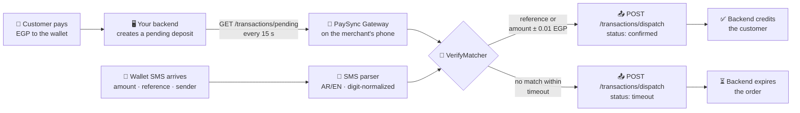

<div align="center">

# 📲 PaySync Gateway

**Turn any Android phone into a 24/7 payment-verification gateway for Egyptian mobile wallets.**

The app polls your backend for pending deposits, matches them against incoming
wallet SMS (Vodafone Cash, InstaPay/NBE, BM, CIB, …), and dispatches
`confirmed` / `timeout` results back — fully automatic, all amounts in **EGP**.

[](https://github.com/Ziadtareks/paysync-gateway/releases/latest/download/PaySync-Gateway.apk)
[](https://github.com/Ziadtareks/paysync-gateway/releases)

[](LICENSE)
[](https://github.com/Ziadtareks/paysync-gateway/actions/workflows/ci.yml)


Sideloaded open-source build (MIT) — **not** distributed via Google Play.

</div>

---

<!-- 📸 Screenshots: drop 2–3 phone screenshots here (Dashboard + Settings),
     like NewPipe/Aegis do. Put the files in a screenshots/ folder, then:
 
-->

## 📥 Download & Install

1. Download the latest APK:
   **[PaySync-Gateway.apk](https://github.com/Ziadtareks/paysync-gateway/releases/latest/download/PaySync-Gateway.apk)**
   (always points to the newest release).
2. On the phone, open the file and allow installing from **unknown sources**
   when prompted (required for any app outside the Play Store).
   - **Play Protect** may warn about unknown apps — choose **Install anyway**
     (the app is open source and reports only to the backend you configure).
3. Grant the SMS + notification permissions on first launch.
   - **Can't grant SMS?** On Android 13+ a twice-denied permission can become
     "restricted": open system **Settings → Apps → PaySync Gateway**, tap the
     **⋮ menu → Allow restricted settings**, then grant it again.
4. Review the [Privacy Policy](PRIVACY.md) — what the app reads, where it
   sends data, and how to delete everything.

**Verify the signature** (optional, apksigner from Android build-tools):

```bash
apksigner verify --print-certs PaySync-Gateway.apk
# SHA-256: b28b28630e30714332f0857bd8d13380e5af7294bfb2cde6475ef64fa52c8748
```

## ✨ What is it?

Selling digital goods or running a Telegram store in Egypt usually means one
thing: waiting for the customer's wallet transfer, then manually checking the
SMS to confirm the payment. **PaySync Gateway** removes the human from that
loop — install it on the phone that receives the wallet SMS, point it at your
backend, and it becomes an always-on bridge.

Built with Kotlin + Jetpack Compose (Material 3), Room, WorkManager and
OkHttp · minSdk 26 · full EN/AR UI with RTL.



## 🚀 Features

| | |
|---|---|
| 🔄 **Always-on** | Foreground service (`dataSync`) polls every 15 s; WorkManager backup poller every 15 min; auto-restart on boot |
| 🌍 **Bilingual** | Full EN/AR UI, automatic RTL, in-app language switcher + Android 13+ system picker |
| 🧾 **Smart SMS parsing** | Vodafone Cash / InstaPay-NBE exact regexes + tolerant fallbacks + generic parser for any bank |
| 🎯 **Two-tier matching** | Exact reference match, then provider + amount tolerance (±0.01 EGP) — **only when exactly one deposit matches**; duplicates of a reference or amount are logged as ambiguous and never auto-confirmed. Race-safe behind a mutex |
| 🛟 **Safety caps** | Turn amount-fallback matching off (reference-only), and set a max auto-confirm amount — above it, payments are logged for manual review. Optional update check via GitHub (see [PRIVACY.md](PRIVACY.md)) |
| 📬 **Reliable outbox** | Dispatches persisted in Room; retry `2s → 64s` (max 6); 4xx dead-letters; Idempotency-Key on every POST |
| 🔐 **Secrets stay secret** | URL/secret/senders in `EncryptedSharedPreferences`, excluded from cloud backups, HMAC-signed dispatches |
| 📊 **Live dashboard** | Pulsing status card, network + battery truth, pending/queue metrics, live dispatch log |

## 📡 Backend API

The app talks to **exactly two endpoints** on your server:

```http
GET  {base}/transactions/pending   → JSON array of pending deposits
POST {base}/transactions/dispatch  → confirmed / timeout results
Headers: X-Gateway-Secret · X-Gateway-Signature (HMAC-SHA256) · Idempotency-Key
```

Field-by-field contract, retry semantics and server checklist:
**[`BACKEND_API_CONTRACT.md`](BACKEND_API_CONTRACT.md)**

## 🤖 No backend yet? Generate one with AI

The [`prompts/`](prompts/) folder ships **ready-made prompts** — paste one into
ChatGPT / Claude / Gemini and get a working backend in minutes:

| File | Builds you |
|---|---|
| [`telegram-bot-prompt.md`](prompts/telegram-bot-prompt.md) | A complete **Telegram store bot** with wallet top-ups |
| [`website-backend-prompt.md`](prompts/website-backend-prompt.md) | A **top-up website** (order page → auto-confirmed from the SMS) |
| [`generic-backend-prompt.md`](prompts/generic-backend-prompt.md) | Just the **2 API endpoints** on a stack you already have |

Full walkthrough (including how to enter the URL + secret in the app):
[`prompts/README.md`](prompts/README.md).

## 📱 Connect your backend in the app

1. **Settings** tab → paste your backend URL in **Bot API URL**.
2. Paste the same **Webhook Secret** your backend checks.
3. Add your wallets to **Allowed senders** — the exact SMS sender IDs
   (e.g. `VF-Cash`, `BanK-AlAhly`), using the same labels your backend sends
   in the `provider` field.
4. **Save** → toggle the gateway **ON** on the Dashboard.
5. Allow the **battery-optimization exemption** when asked.

> Testing locally? Run the backend on your PC and enter
> `http://<your-pc-ip>:8000` — **cleartext HTTP only works in debug builds**
> (`./gradlew :app:assembleDebug`); release builds reject plain HTTP and
> accept HTTPS URLs only. Use HTTPS in production.

## 🔐 Security

- Settings (URL, secret, senders) live in **EncryptedSharedPreferences** and
  are excluded from cloud backups, device transfers, and backup (the Room DB
  with SMS texts is excluded too).
- Every dispatch is **HMAC-SHA256-signed over the raw body**; the secret never
  leaves the device except as the auth header, and an **Idempotency-Key** makes
  server-side retries safe. Release builds reject cleartext HTTP; only debug
  builds allow local plaintext testing.
- **Honest limitation:** an SMS sender ID is **not cryptographic proof**.
  Sender IDs can be spoofed in some networks, and a leaked/stolen SIM is
  indistinguishable from the real one. PaySync reduces this risk (exact
  sender allow-list, unambiguous matching only, per-deposit references) but
  cannot eliminate it. We recommend:
  1. setting a **max auto-confirm amount** (Settings → Matching Safety), and
  2. periodically reconciling auto-confirmed payments against your wallet's
     official statement (Vodafone Cash / bank app) — treat PaySync as an
     automation layer, not as an auditor.
- `.gitignore` blocks keystores and `.env` files; no secrets are committed.

## 🔋 Keeping it alive 24/7

The gateway restarts after reboot and alerts you with a high-priority
notification if it cannot reach your backend for 5+ minutes. Phones from
**Xiaomi, Samsung, Oppo/Realme and Huawei/Honor** additionally kill
background apps silently — allow PaySync in the manufacturer's own settings
(App info → Autostart / No battery restrictions / Never-sleeping apps, per
the in-app guide on the Permissions screen). The battery-optimization
exemption prompt stays mandatory.

## 🛠️ Build from source

**Prerequisites:** Android Studio (Ladybug+) with **JDK 17**, a physical
Android 8.0+ device (SMS receivers are unreliable on emulators).

```bash
git clone https://github.com/Ziadtareks/paysync-gateway.git
cd paysync-gateway
./gradlew :app:testDebugUnitTest   # 39 unit tests — parser, matcher, HMAC
./gradlew :app:assembleDebug       # debug APK
```

CI runs the unit tests, lint, debug + release (R8) builds on every push/PR,
and the instrumented test suite on API 34/35 emulators.

> **Windows CLI:** set `JAVA_HOME` to a JDK 17 — the project does not build on
> JDK 21+.
>
> **Releases:** maintainers build the signed APK (release variant signs from a
> local, gitignored `keystore.properties`) and attach it with
> `gh release create vX.Y.Z PaySync-Gateway.apk`.

## 🤝 Contributing

PRs welcome! Keep regex changes covered by the sample-based unit tests, no new
DI frameworks, no Play-services dependencies, and run
`./gradlew :app:testDebugUnitTest` before opening a PR.

## ⚠️ Disclaimer

This project is an independent, open-source tool for automating **your own**
payment confirmations on a device **you own**. It is not affiliated with or
endorsed by Vodafone, Orange, Etisalat, WE, NBE, CIB, Banque Misr, InstaPay,
or any other provider. Always obtain consent before connecting a device, and
follow the terms of service of your wallet provider and local regulations.

## 📄 License

[MIT](LICENSE) © 2026 PaySync Gateway contributors
