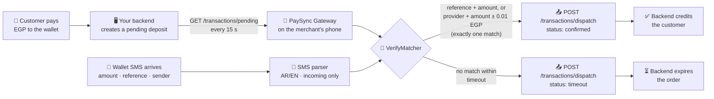

<div align="center">

# 📲 PaySync Gateway

**Turn any Android phone into a 24/7 payment-verification gateway for Egyptian mobile wallets.**

The app polls your backend for pending deposits, matches them against incoming
wallet SMS (Vodafone Cash, InstaPay/NBE, BM, CIB, …), and dispatches
`confirmed` / `timeout` results back — fully automatic, all amounts in **EGP**.

[](https://github.com/Ziadtareks/paysync-gateway/releases/latest)
[](https://github.com/Ziadtareks/paysync-gateway/releases)

[](LICENSE)


Sideloaded open-source build (MIT) — **not** distributed via Google Play.

</div>

---

## 🆕 What's new in v1.2.0

A payment-safety, reliability and security release. Full details:
[CHANGELOG.md](CHANGELOG.md).

- 🔐 **New secure settings storage** — URL, secret and senders are encrypted
  with **AES-256-GCM** using a key held in the **Android Keystore**, replacing
  the deprecated AndroidX `security-crypto` library.
- 🔄 **Automatic, crash-safe settings migration** — on first launch after the
  update, your existing settings are copied, verified and only then is the
  old file removed. Nothing to re-enter.
- 💸 **No more lost or double payments** — failed dispatches stay queued until
  your backend accepts them; a matched deposit can never be confirmed twice or
  timed out after confirmation.
- 🎯 **Safer matching** — a reference must also match the amount; outgoing
  transfers/debits are never treated as deposits; payments that arrive before
  the deposit reaches the phone are matched late.
- ✍️ **Signed requests without sending the secret** — new
  `X-Gateway-Signature-V2` (timestamp + method + path + body) on every request.
- 🧹 Smaller permission set (`READ_SMS` removed), clearer Dashboard ("Needs
  review" entries), honest "Last poll" and "Poll now" results.

## 📥 Download & install

1. Open the **[latest release](https://github.com/Ziadtareks/paysync-gateway/releases/latest)**
   and download **`app-release.apk`** under *Assets* (older versions are on the
   [Releases page](https://github.com/Ziadtareks/paysync-gateway/releases)).
2. On the phone, open the file and allow installing from **unknown sources**
   when prompted (required for any app outside the Play Store).
   - **Play Protect** may warn about unknown apps — choose **Install anyway**
     (the app is open source and reports only to the backend you configure).
3. Grant the **SMS** and **notification** permissions on first launch.
   - **Can't grant SMS?** On Android 13+ a twice-denied permission can become
     "restricted": open **Settings → Apps → PaySync Gateway → ⋮ → Allow
     restricted settings**, then grant it again.
4. Review the [Privacy Policy](PRIVACY.md) — what the app reads, where it sends
   data, and how to delete everything.

### Upgrading an existing install

**Install the new APK over the old one — do not uninstall.** It is signed with
the same key, so Android updates it in place, the gateway resumes by itself,
and your settings are migrated to the new encrypted storage automatically.
(Uninstalling first would erase your settings.) Coming from v1.1.0 or older:
if the Dashboard does not show "Running", tap **Restart Gateway**.

### Verify the download (optional)

```bash
# Signing certificate — must match for every official release:
apksigner verify --print-certs app-release.apk
# SHA-256: b28b28630e30714332f0857bd8d13380e5af7294bfb2cde6475ef64fa52c8748

# File checksum (v1.2.0):
echo "d821bdc4db80ed58ee3ff8ea2f53fb3089f653a65953cdf1c90b73622b295712  app-release.apk" | sha256sum -c -
```

## ✨ What is it?

Selling digital goods or running a Telegram store in Egypt usually means one
thing: waiting for the customer's wallet transfer, then manually checking the
SMS to confirm the payment. **PaySync Gateway** removes the human from that
loop — install it on the phone that receives the wallet SMS, point it at your
backend, and it becomes an always-on bridge.

Built with Kotlin + Jetpack Compose (Material 3), Room, WorkManager and
OkHttp · minSdk 26 · full EN/AR UI with RTL.



## 🚀 Features

| | |
|---|---|
| 🔄 **Always-on** | Foreground service polls every 15 s; WorkManager backup poller every 15 min; auto-restart after reboot and after app updates |
| 🌍 **Bilingual** | Full EN/AR UI, automatic RTL, in-app language switcher + Android 13+ system picker |
| 🧾 **Smart SMS parsing** | Vodafone Cash / InstaPay-NBE exact regexes + tolerant fallbacks + generic parser for any bank; outgoing transfers, debits and balance-only SMS are ignored |
| 🎯 **Safe matching** | Exact reference **and** amount, then provider + amount (±0.01 EGP) — **only when exactly one deposit matches**; ambiguous or mismatched SMS go to **Needs review**, never auto-confirmed. Late matching for SMS that arrive before the deposit is polled. Race-safe behind a mutex + Room transactions |
| 🛟 **Safety caps** | Turn amount-fallback matching off (reference-only) and set a max auto-confirm amount — above it, payments are logged for manual review |
| 📬 **Reliable outbox** | Dispatches persisted in Room and retried until delivered (fast `2s → 32s`, then in the background); only `400/404/409/410/422` dead-letter; Idempotency-Key on every POST |
| 🔐 **Secrets stay secret** | Settings encrypted with AES-256-GCM + Android Keystore; HMAC-signed requests (V2 signature never sends the secret); excluded from all backups |
| 📊 **Live dashboard** | Honest running status, network + battery truth, pending/queue metrics, live dispatch log |

## 🔒 Secure settings storage

Since v1.2.0 the app stores its settings with its own, dependency-free
encryption instead of the deprecated AndroidX `security-crypto` library:

- **AES-256-GCM** per value, with a **256-bit key generated inside the Android
  Keystore** — the key never leaves it and is not exportable.
- Each value is **bound to its setting name** (GCM associated data): a value
  copied onto another setting fails to decrypt instead of being accepted.
- Tampered or undecryptable values are read as "not set" — never a crash.
- If a device's Keystore is broken, the app falls back to a separate
  unencrypted file and shows a **red warning in Settings**.

**Automatic migration from the legacy library** (first launch after
upgrading from v1.1.x):

1. read every legacy setting (legacy file untouched);
2. copy it into the new encrypted store;
3. re-read and **verify every value**;
4. only then mark the migration done and delete the legacy file.

Any failure before step 4 **rolls the copy back**, keeps the legacy file, keeps
the app running on the old settings, and retries on the next launch. Values
you save while a migration is pending are never overwritten by older ones.
`security-crypto` remains only as a read-only legacy reader for this migration
and will be removed in a later release.

## 📡 Backend API

The app talks to **exactly two endpoints** on your server:

```http
GET  {base}/transactions/pending   → JSON array of pending deposits
POST {base}/transactions/dispatch  → confirmed / timeout results
Headers: X-Gateway-Timestamp · X-Gateway-Signature-V2 · X-Gateway-Signature (legacy)
         X-Gateway-Secret (legacy, can be switched off) · Idempotency-Key
```

Field-by-field contract, signature format, retry semantics and server
checklist: **[`BACKEND_API_CONTRACT.md`](BACKEND_API_CONTRACT.md)**.
Existing backends keep working unchanged.

### 🤖 No backend yet? Generate one with AI

The [`prompts/`](prompts/) folder ships **ready-made prompts** — paste one into
ChatGPT / Claude / Gemini and get a working backend in minutes:

| File | Builds you |
|---|---|
| [`telegram-bot-prompt.md`](prompts/telegram-bot-prompt.md) | A complete **Telegram store bot** with wallet top-ups |
| [`website-backend-prompt.md`](prompts/website-backend-prompt.md) | A **top-up website** (order page → auto-confirmed from the SMS) |
| [`generic-backend-prompt.md`](prompts/generic-backend-prompt.md) | Just the **2 API endpoints** on a stack you already have |

Full walkthrough: [`prompts/README.md`](prompts/README.md).

## 📱 Connect your backend in the app

1. **Settings** tab → paste your backend URL in **Bot API URL**.
2. Paste the same **Webhook Secret** your backend checks (required).
3. Add your wallets to **Allowed senders** — the exact SMS sender IDs
   (e.g. `VF-Cash`, `BanK-AlAhly`), using the same labels your backend sends
   in the `provider` field.
4. **Save** → toggle the gateway **ON** on the Dashboard.
5. Allow the **battery-optimization exemption** when asked.
6. Once your backend verifies `X-Gateway-Signature-V2`, turn **off**
   "Send raw secret header (legacy)" so the secret never travels over the
   network.

> Testing locally? Run the backend on your PC and enter
> `http://<your-pc-ip>:8000` — **cleartext HTTP only works in debug builds**;
> release builds accept HTTPS URLs only.

## 🔐 Security

- Settings are encrypted at rest (see [Secure settings storage](#-secure-settings-storage))
  and, like the Room database with SMS texts, excluded from cloud backups and
  device transfers.
- Every request is **HMAC-SHA256-signed** (V2 covers timestamp, method, path,
  Idempotency-Key and body); an **Idempotency-Key** makes retries safe.
  Release builds reject cleartext HTTP.
- Only `RECEIVE_SMS` is requested — the SMS inbox is never read.
- **Honest limitation:** an SMS sender ID is **not cryptographic proof**.
  Sender IDs can be spoofed in some networks, and a leaked/stolen SIM is
  indistinguishable from the real one. PaySync reduces this risk (exact
  sender allow-list, incoming-only parsing, unambiguous matching, reference +
  amount checks) but cannot eliminate it. We recommend:
  1. setting a **max auto-confirm amount** (Settings → Matching Safety), and
  2. periodically reconciling auto-confirmed payments against your wallet's
     official statement — treat PaySync as an automation layer, not an auditor.

## 🔋 Keeping it alive 24/7

The gateway restarts after reboot and after app updates, and alerts you with
a high-priority notification if it cannot reach your backend for 5+ minutes.
Phones from **Xiaomi, Samsung, Oppo/Realme and Huawei/Honor** additionally
kill background apps silently — allow PaySync in the manufacturer's own
settings (App info → Autostart / No battery restrictions / Never-sleeping
apps, per the in-app guide on the Permissions screen). The
battery-optimization exemption prompt stays mandatory.

## 🛠️ Build, test & release

**Prerequisites:** Android Studio with **JDK 17** (the project does not build
on JDK 21+ from the CLI), Android SDK platform 34.

```bash
git clone https://github.com/Ziadtareks/paysync-gateway.git
cd paysync-gateway
./gradlew :app:testDebugUnitTest        # unit tests — parser, matcher, HMAC, encryption, …
./gradlew :app:lint :app:assembleDebug  # lint + debug APK
./gradlew :app:connectedDebugAndroidTest # device tests (phone or emulator attached)
```

- **Release builds:** signed from a local, gitignored `keystore.properties`;
  without it the release APK is left unsigned. APKs are published only as
  GitHub Release assets, never committed. Step-by-step:
  **[`docs/BUILD_RELEASE.md`](docs/BUILD_RELEASE.md)**.
- **Before publishing:** run the real-device checklist
  **[`docs/DEVICE_TEST_CHECKLIST.md`](docs/DEVICE_TEST_CHECKLIST.md)** — above
  all the install-over-the-previous-release upgrade test.
- A GitHub Actions workflow ([`ci.yml`](.github/workflows/ci.yml)) runs unit
  tests, lint, debug + release builds and the device tests on API 34/35
  emulators when Actions is enabled for the repository.

## 📚 Documentation

| Document | What's in it |
|---|---|
| [CHANGELOG.md](CHANGELOG.md) | What changed in every version |
| [BACKEND_API_CONTRACT.md](BACKEND_API_CONTRACT.md) | The two endpoints, headers, signatures, status codes |
| [PRIVACY.md](PRIVACY.md) | What the app reads, stores and sends (EN/AR) |
| [docs/BUILD_RELEASE.md](docs/BUILD_RELEASE.md) | Building, signing, verifying and publishing a release |
| [docs/DEVICE_TEST_CHECKLIST.md](docs/DEVICE_TEST_CHECKLIST.md) | Real-device test plan (Keystore, migration, payments) |
| [prompts/](prompts/) | AI prompts to generate a compatible backend |

## 🤝 Contributing

PRs welcome! Keep regex changes covered by the sample-based unit tests, no new
DI frameworks, no Play-services dependencies, and run
`./gradlew :app:testDebugUnitTest :app:lint` before opening a PR.

## ⚠️ Disclaimer

This project is an independent, open-source tool for automating **your own**
payment confirmations on a device **you own**. It is not affiliated with or
endorsed by Vodafone, Orange, Etisalat, WE, NBE, CIB, Banque Misr, InstaPay,
or any other provider. Always obtain consent before connecting a device, and
follow the terms of service of your wallet provider and local regulations.

## 📄 License

[MIT](LICENSE) © 2026 PaySync Gateway contributors
