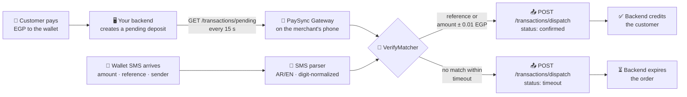

<div align="center">

# 📲 PaySync Gateway

**Turn any Android phone into a 24/7 payment-verification gateway for Egyptian mobile wallets.**

The app polls your backend for pending deposits, matches them against incoming
wallet SMS (Vodafone Cash, InstaPay/NBE, BM, CIB, …), and dispatches
`confirmed` / `timeout` results back — fully automatic, all amounts in **EGP**.

[](https://github.com/Ziadtareks/paysync-gateway/actions/workflows/ci.yml)
[](LICENSE)


Sideloaded open-source build (MIT) — **not** distributed via Google Play.

</div>

---

## ✨ What is it?

Selling digital goods or running a Telegram store in Egypt usually means one
thing: waiting for the customer's wallet transfer, then manually checking the
SMS to confirm the payment. **PaySync Gateway** removes the human from that
loop.

Install the app on the phone that receives the wallet SMS, point it at your
backend (a Telegram bot, a website, anything with 2 HTTP endpoints), and it
becomes a always-on bridge:

- 🔁 **Polls** your backend every 15 s for pending deposits (15-min WorkManager
  backup when the service is killed).
- 🧾 **Parses** every incoming wallet SMS — bilingual AR/EN, Arabic-Indic
  digits normalized, per-provider regexes with hardened fallbacks.
- 🎯 **Matches** deposits to SMS: exact `reference_id` first, then
  provider + amount within **±0.01 EGP**.
- 📤 **Dispatches** the verdict (`confirmed` / `timeout`) back to your backend,
  signed with **HMAC-SHA256** and deduped with an **Idempotency-Key**.
- 🧠 **Survives** reboots, dead zones and crashes — every dispatch lives in a
  local outbox (Room) with exponential-backoff retries until ACKed.

## ⚙️ How it works



## 🚀 Features

| | |
|---|---|
| 🔄 **Always-on** | Foreground service (`dataSync`) polls every 15 s; WorkManager backup poller every 15 min; auto-restart on boot |
| 🌍 **Bilingual** | Full EN/AR UI (95 string keys each), automatic RTL, in-app language switcher + system picker |
| 🧾 **Smart SMS parsing** | Vodafone Cash / InstaPay-NBE exact regexes + tolerant fallbacks + generic parser for any bank |
| 🎯 **Two-tier matching** | Exact reference match, then provider + amount tolerance (±0.01 EGP), race-safe behind a mutex |
| 📬 **Reliable outbox** | Dispatches persisted in Room; retry `2s → 64s` (max 6); 4xx dead-letters; Idempotency-Key on every POST |
| 🔐 **Secrets stay secret** | URL/secret/senders in `EncryptedSharedPreferences`, excluded from cloud backups, HMAC-signed dispatches |
| 📊 **Live dashboard** | Pulsing status card, network + battery truth, pending/queue metrics, live dispatch log |
| 🔋 **Real-world hardened** | Battery-optimization exemption flow, Doze-resistant polling, dedup ledger for twin SMS broadcasts |

## 🧱 Tech stack

| Layer | Tools |
|---|---|
| Language | Kotlin 1.9.24 · Java 17 · minSdk 26 · targetSdk 34 |
| UI | Jetpack Compose + Material 3 · Navigation Compose · dynamic colors (Android 12+) |
| Async | Coroutines + Flow (zero `GlobalScope`, zero `runBlocking` in production) |
| Network | OkHttp 4.12 + Gson |
| Persistence | Room 2.6.1 (schema v4, 5 tables) · EncryptedSharedPreferences |
| Background | Foreground Service (`dataSync`) · WorkManager 2.9 (expedited dispatch + periodic drains) |
| DI | Manual container — no Hilt/Koin, single `:app` module |

## 📡 Backend API

The app talks to **exactly two endpoints** on your server:

```http
GET  {base}/transactions/pending   → JSON array of pending deposits
POST {base}/transactions/dispatch  → confirmed / timeout results
Headers: X-Gateway-Secret · X-Gateway-Signature (HMAC-SHA256) · Idempotency-Key
```

**Full field-by-field contract (responses, retry semantics, server checklist):
[`BACKEND_API_CONTRACT.md`](BACKEND_API_CONTRACT.md)**

## 🤖 No backend yet? Generate one with AI

The [`prompts/`](prompts/) folder ships **ready-made prompts** you can paste
into ChatGPT / Claude / Gemini / Copilot to get a working backend in minutes:

| File | Builds you |
|---|---|
| [`prompts/telegram-bot-prompt.md`](prompts/telegram-bot-prompt.md) | A complete **Telegram store bot** with wallet top-ups, powered by the gateway |
| [`prompts/website-backend-prompt.md`](prompts/website-backend-prompt.md) | A **top-up website** (order page → auto-confirmed when the SMS arrives) |
| [`prompts/generic-backend-prompt.md`](prompts/generic-backend-prompt.md) | Just the **2 API endpoints** on any stack you already have |

Copy → paste → run → enter the URL + secret in the app. Full walkthrough in
[`prompts/README.md`](prompts/README.md).

## 📱 Connect your backend in the app

1. Open **Settings** tab.
2. **Bot API URL** — your backend base URL, e.g. `https://api.mybot.com`
   (trailing `/` is trimmed; endpoints are appended as
   `/transactions/pending` and `/transactions/dispatch`).
3. **Webhook Secret** — the same shared secret your backend checks in
   `X-Gateway-Secret` (stored encrypted, shown masked with a visibility toggle).
4. **Polling interval** — seconds between polls (5–300, default 15).
5. **Allowed senders** — the exact SMS sender IDs your wallets use
   (e.g. `VF-Cash`, `BanK-AlAhly`). Matching is exact, case-insensitive —
   add every provider you accept, and use the same labels your backend sends
   in the `provider` field.
6. **Save** → go to **Dashboard** → toggle the gateway **ON** → allow the
   battery-optimization exemption when asked.

> Testing locally on your PC? Run the backend on your LAN and enter
> `http://<your-pc-ip>:8000` — cleartext HTTP is permitted by the app's
> network config for exactly this reason. Use HTTPS in production.

## 🔐 Security

- Settings (URL, secret, senders) live in **EncryptedSharedPreferences**
  (AES-256-GCM/SIV), with a plain-prefs fallback so broken-keystore devices
  keep working. Secrets are excluded from cloud backups and device transfers
  (`backup_rules.xml` / `data_extraction_rules.xml`).
- Every dispatch carries `X-Gateway-Secret` plus an **HMAC-SHA256 signature of
  the raw body** — the secret never leaves the device except as the auth
  header.
- **Idempotency-Key** (UUID minted at match time) makes server-side retries
  safe; the backend contract requires dedup on it and forbids double-crediting.
- `.gitignore` blocks keystores and `.env` files; no secrets are committed.

## 🛠️ Build & test

**Prerequisites:** Android Studio (Ladybug+) with **JDK 17**, a physical
Android 8.0+ device (SMS receivers are unreliable on emulators).

```bash
git clone https://github.com/<you>/paysync-gateway.git
cd paysync-gateway
```

1. Open the folder in Android Studio and let it sync.
2. Run the unit tests:
   ```bash
   ./gradlew :app:testDebugUnitTest     # 18 tests — parser, matcher, HMAC
   ```
3. Run on a **physical device** (`adb install app/build/outputs/apk/debug/app-debug.apk`
   or press ▶ in Android Studio).
4. Grant SMS + notification permissions, point the app at your backend, toggle ON.

> **Windows CLI builds:** set `JAVA_HOME` to a JDK 17 (e.g. Android Studio's
> bundled `~/.jdks/corretto-17`) — the project does not build on JDK 21+.

### Release build

The release variant is signed from `keystore.properties` (gitignored) +
`paysync-release.keystore` at the repo root. Fresh clones without those files
automatically fall back to the debug key, so CI and contributors never break.

```bash
./gradlew :app:assembleRelease
# → app/build/outputs/apk/release/app-release.apk
```

Or from Android Studio: **Build → Select Build Variant → release**, then
**Build → Build App Bundle(s) / APK(s) → Build APK(s)**.

> Keep the keystore + its passwords backed up — updates must be signed with
> the same key or Android will refuse to install them over an existing build.

## 📁 Project layout

```
data/      SettingsManager · Models · TransactionParser · HmacSha256
           ApiClient (+HmacInterceptor) · GatewayRepository · db/ (Room v4)
domain/    VerifyMatcher
receiver/  SmsReceiver (goAsync + bounded scope + dedup ledger) · BootReceiver
service/   PaymentForegroundService (15 s poll loop, dataSync, net-callback flush)
work/      PollingWorker (15 min backup) · DispatchWorker (expedited, backoff)
ui/        MainActivity (NavHost) · MainViewModel · theme/ · screens/ · nav/
util/      LocaleHelper · NetworkMonitor
```

Unit tests: `TransactionParserTest` (real AR/EN wallet samples),
`VerifyMatcherTest`, `HmacTest` (RFC-4231 vector).

## 🌍 Localization

- `values/strings.xml` + `values-ar/strings.xml` (95 keys each) with automatic
  RTL mirroring.
- Instant in-app switcher (`AppCompatDelegate.setApplicationLocales`) plus the
  Android 13+ system picker (`locales_config.xml`).
- The foreground-service notification is localized too.

## 🤝 Contributing

PRs welcome! Ground rules:

- Keep regex changes covered by the sample-based unit tests.
- No new DI frameworks, no Play-services dependencies.
- Run `./gradlew :app:testDebugUnitTest` before opening a PR.

## ⚠️ Disclaimer

This project is an independent, open-source tool for automating **your own**
payment confirmations on a device **you own**. It is not affiliated with or
endorsed by Vodafone, Orange, Etisalat, WE, NBE, CIB, Banque Misr, InstaPay,
or any other provider. Always obtain consent before connecting a device, and
follow the terms of service of your wallet provider and local regulations.

## 📄 License

[MIT](LICENSE) © 2026 PaySync Gateway contributors
